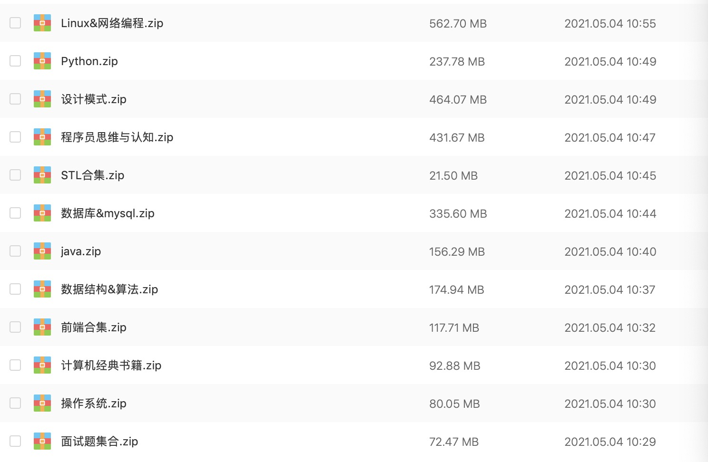

<h1 align="center">Findyi的经典计算机书单分享 （超过100本经典书籍，持续更新中...）</h1>

### 食用指南
强烈推荐一个良心微信公众号：**『findyi』**

如果你是一名程序员，想获得高速成长，获取你想获取各类电子书，那么可以关注我的公众号**『findyi』**，微信搜索即可关注。

自我介绍下自己：前360技术总监，目前担任某在线教育公司CTO，12年的技术产品经验，多年管理经验，愿在你的成长道路上，陪伴你同行。

在这个公众号里，我专注于分享程序员认知提升，管理进阶等知识，是每个程序员的必修内功，同时我也整理基本覆盖所有常用电子书，在我的公众号通过关键字即可获取哦。

<h2>目录</h2>

[操作系统](#操作系统) 
[数据库](#数据库) 
[网络&Linux](#网络&Linux) 
[数据结构与算法](#数据结构与算法) 
[设计模式](#设计模式) 
[编程](#编程) 
[面试](#面试) 
[思维与认知](#思维与认知) 

### 操作系统
- [图解系统-小林](https://pan.baidu.com/s/1Qt1oVoyXDE-qVllLbWMd1g?pwd=xyyv)
- [30天自制操作系统](https://pan.baidu.com/s/14KoM_fuDRa2mwqmmUJ2QWA?pwd=dv89)
- [操作系统之哲学原理](https://pan.baidu.com/s/1nM5d-G-ENHLcyM0thIgk-g?pwd=he8i)
- [计算机是怎样跑起来的](https://pan.baidu.com/s/1DI_3Oi-O_f125jai60oRPA?pwd=ehka)
- [现代操作系统](https://pan.baidu.com/s/1lnRpQjcdcel7m0JOaBN-aQ?pwd=2rju)
- [手绘图解计算机基础](https://pan.baidu.com/s/1sGcfw8rDHKwOgNY2XdCZYg?pwd=ve45)

### 数据库
- [高性能MySQL](https://pan.baidu.com/s/1A_YQfN7d0Io9TGXsfoQcrg?pwd=dwe3)
- [MySQL技术内幕](https://pan.baidu.com/s/1DTIK4hcjGQAot46ES0uw_g?pwd=un8c)
- [MySQL必知必会](https://pan.baidu.com/s/126n8yk6wH6g8lVC8_FeIjA?pwd=mk85)
- [深入浅出MySQL](https://pan.baidu.com/s/1nq_n0RwDMOCErjSVHYe_HQ?pwd=a8tv)
- [Redis实战](https://pan.baidu.com/s/13AaelonbL46H9IaIThz8WQ?pwd=r7kd)

### 网络&Linux
- [网络是怎样连接的](https://pan.baidu.com/s/11Q4KXEpFWM5KyFqJToOgeA?pwd=wkc5)
- [图解网络](https://pan.baidu.com/s/1ixzGcWSz6be2VniM7nDcLw?pwd=v9jg)
- [手绘图解HTTP](https://pan.baidu.com/s/1V562EWUDzuSu8Fgpp1Tpug?pwd=af3y)
- [图解TCP/IP](https://pan.baidu.com/s/13VnUNDbTxiDWtyUnwUJ-Nw?pwd=xe3p)
- [HTTP权威指南](https://pan.baidu.com/s/19QP1Kbpggrsn8wcy_hHu-g?pwd=8rqg)
- [图解HTTP](https://pan.baidu.com/s/1rO4FiOM9VVUx0Hg-GvZjQQ?pwd=vdkc)
- [计算机网络](https://pan.baidu.com/s/14NMEeEX51Uy9equZSGkCrw?pwd=wuyq)
- [深入Linux内核架构](https://pan.baidu.com/s/1r2l-zYYyU6iBrUEXmYWPBQ?pwd=kik6)
- [鸟哥的Linux私房菜](https://pan.baidu.com/s/1v7ul4ozGEwsAcof1rxPOQA?pwd=ndyc)
- [Linux宝典](https://pan.baidu.com/s/1DGPcPnJGthY60QSKZR4zsg?pwd=tbg7)
- [Unix网络编程](https://pan.baidu.com/s/1A0yGCQpNs3ySna-nl4V1iQ?pwd=is82)
- [大型网站技术架构](https://pan.baidu.com/s/1ClMed-LmPOaTo7rbF_hv-A?pwd=dvtn)

### 数据结构与算法
- [数据结构与算法分析](https://pan.baidu.com/s/1T1G36FIqGMGc2a_9Kqp-ng?pwd=4jbt)
- [剑指offer](https://pan.baidu.com/s/1cVYzOVM4Z_fAm6EOw1U4vg?pwd=f7hu)
- [大话数据结构](https://pan.baidu.com/s/1EetKL8UnZ5VFoH6R8CvTJQ?pwd=5fyv)
- [数据结构与算法分析-C语言](https://pan.baidu.com/s/1YL8Ep0106_MkS3e1QfiTbQ?pwd=mbse)
- [程序员的算法趣题](https://pan.baidu.com/s/1cs_CeOpZovwPN5yuQ92Zyw?pwd=5stw)
- [啊哈算法](https://pan.baidu.com/s/1w6pFXkSZDE0xDY_KKkMzPQ?pwd=hyjg)
- [算法图解](https://pan.baidu.com/s/1Ge2DeKo30pQ_ja9l21Flkw?pwd=emg5)

### 设计模式
- [图解设计模式](https://pan.baidu.com/s/13L3kMYpMj6N0w-TAYgpl3Q?pwd=h8bm)
- [研磨设计模式](https://pan.baidu.com/s/1yfh2wnxOtqwEVvpKHL251g?pwd=etjn)
- [Head First设计模式](https://pan.baidu.com/s/1oSRKxQ8OqIr7xTjB_gEWzg?pwd=f8yx)
- [设计模式之禅](https://pan.baidu.com/s/1f0r7UTLUUpu0Lpui1c9yqA?pwd=uwwe)
- [图解设计模式2](https://pan.baidu.com/s/1Sb_BhH3Ny7uqNiW9jTYt4w?pwd=7mvn)
- [重学Java设计模式](https://pan.baidu.com/s/1Ke4xYAXGa3jcDH-_N7hAvg?pwd=865y)

### 编程
- [编程之美](https://pan.baidu.com/s/1SyzsY_jQGUYo2HxwDroBYA?pwd=qxjd)
- [编程珠玑](https://pan.baidu.com/s/1hWGkSKVB6wPAUzDrf8LWUA?pwd=3v55)
- [代码整洁之道](https://pan.baidu.com/s/1HA1zzj33M5lnL0mHI5XTtg?pwd=kyj9)
- [Java并发编程的艺术](https://pan.baidu.com/s/1Yf4FuFbq41y7DQkxdRzQ-Q?pwd=ei54)
- [阿里巴巴Java开发手册](https://pan.baidu.com/s/1P0GIjfBSoc326EeTlJR8Pg?pwd=qy52)
- [Java8实战](https://pan.baidu.com/s/18FGMgaAEpjB7OeD9b8iYvw?pwd=5p36)
- [Effective Java](https://pan.baidu.com/s/1JxWPJhh4nkhg1-0nUDRQPQ?pwd=fpj2)
- [Head First Java](https://pan.baidu.com/s/1Xme52mQp1HhBH41-xrHT2Q?pwd=f7x5)
- [Java编程思想](https://pan.baidu.com/s/1MF0243hznoF3rW8DB52hbA?pwd=x6c8)
- [Python黑魔法指南](https://pan.baidu.com/s/1hb4-_ye2LaVBDM0gINlZMg?pwd=rcfw)
- [Python数据处理](https://pan.baidu.com/s/1WFvWM8Z0EvGI6t8lBuRNiw?pwd=4iub)
- [Python编程初学者指南](https://pan.baidu.com/s/1q9cNqEdyQbzixkg27C5cjw?pwd=g771)
- [Python高性能编程](https://pan.baidu.com/s/10xN0Ahj645D9kH4h8lRT0w?pwd=a52u)
- [Python数据分析实战](https://pan.baidu.com/s/12jrNgkEsyu4BdIoDaNwCaQ?pwd=3kch)
- [Python机器学习及实践](https://pan.baidu.com/s/1HWcpIlP0gjv8tM_Tw75UcQ?pwd=zdsu)
- [HTML5与CSS3基础教程](https://pan.baidu.com/s/1A9USH-6YjdxS1vxRSU-Gaw?pwd=tkkp)
- [JavaScript高效图形编程](https://pan.baidu.com/s/1Ii3MGmPIOrhR2gxgz1lCfw?pwd=4mkk)
- [HTML5揭秘](https://pan.baidu.com/s/1AECVi-seOjoXracdOy0Hvg?pwd=kiu8)
- [JavaScript高级程序设计（第3版）](https://pan.baidu.com/s/1XeFUZ4dOIeTrOEOdS7cAPw?pwd=yrit)
- [Go Web编程](https://pan.baidu.com/s/1bpgHZG7Qu3JCxlyXoBi2_g?pwd=pg21)

### 面试
- [Java架构师面试题](https://pan.baidu.com/s/1HGiAcBHK84V6DVsM_dyacA?pwd=udak)
- [Java基础知识篇](https://pan.baidu.com/s/1a9fILz2Bd6YXSTJMGr89jA?pwd=skwe)
- [Java集合框架常见面试题](https://pan.baidu.com/s/1cJIE3RWWXHtT6_9mEvr4rA?pwd=eijc)
- [JavaGuide面试突击版](https://pan.baidu.com/s/1z47YXkDsmxb_2FfiV2zsLg?pwd=gpik)
- [MySQL面试题详解](https://pan.baidu.com/s/10kOyFts6p7kJfC1OzVDe0g?pwd=rjse)
- [C&C++ 面试题](https://pan.baidu.com/s/1Cd6bJfg9g5Xlf2h6Fb3bng?pwd=n4ep)
- [Python面试题](https://pan.baidu.com/s/1q6GDl_Edwnzp_b6JLp4vkw?pwd=n2re)
- [程序员面试宝典](https://pan.baidu.com/s/18k3J0Z2x78qDPSm1dHXkLg?pwd=3117)

### 思维与认知
- [软技能 - 代码之外的生存之道](https://pan.baidu.com/s/15fdOYrQa6uCmgRCqgHIcJw?pwd=h6rm)
- [技术学习路线思维导图55张](https://pan.baidu.com/s/1ZE8iuS7UQnRDjSKCz3Nsdg?pwd=xt25)
- [人月神话](https://pan.baidu.com/s/1LnrB5BnZh9uQlskm_93HMQ?pwd=wrtn)

<h2>汇总</h2>
我把电子书资源放在公众号【findyi】上了，扫码关注下面公众号，回复「pdf」 获取所有打包经典书籍资源:

<h2>微信公众号</h2>

